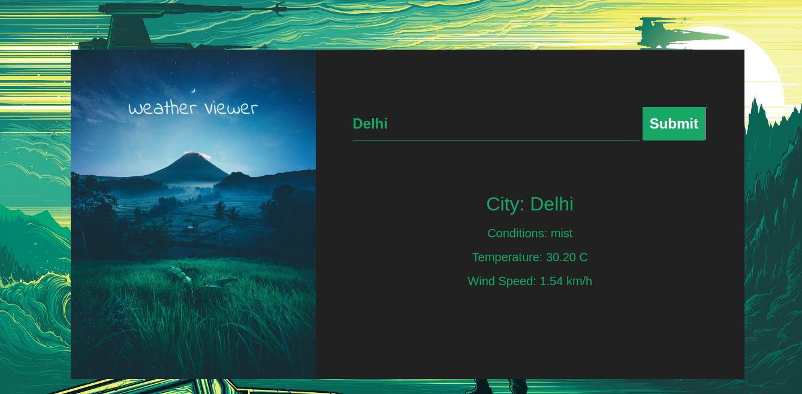

# Paraytan_Tourism_Management

In this project, we will build an app that will find the device’s location coordinates. Then we will send this data to the API via an API key. The API will send us a JSON from which we will extract the required data that is the temperature and city of the location.

## How to run
1. Download this repository and extract the file
2. Run 'index.html' file in browser

## Screenshot

